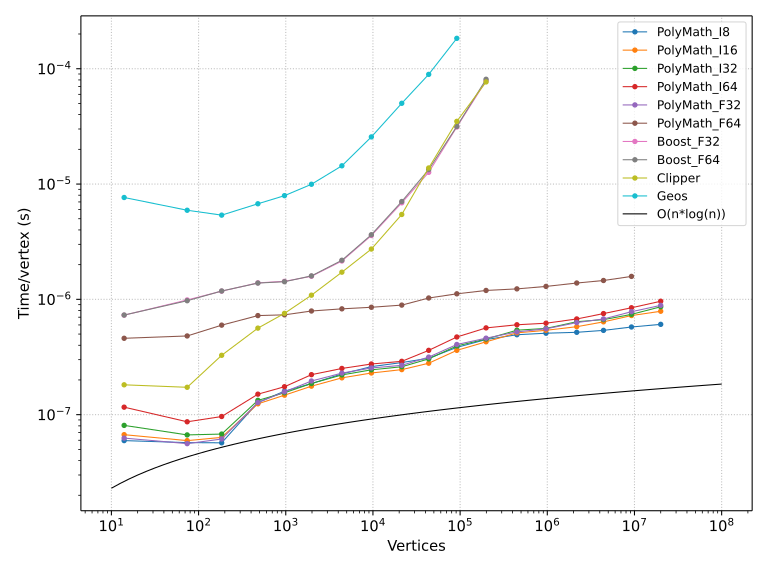

PolyMath
========

PolyMath (Polygon Mathematics) is a library that can perform various mathematical operations on polygons, such as:
- Boolean operations: union (OR), intersection (AND), difference (AND NOT), symmetric difference (XOR)
- Triangulation
- Monotone polygon generation
- Keyhole polygon generation

This library is still under development, the API may change at any time.

Performance
-----------

PolyMath is designed to be as fast as possible, especially when dealing with large datasets. For example, for large union operations PolyMath is several orders of magnitude faster than several popular open-source alternatives:

This high speed is achieved by using a single pass sweepline algorithm with very efficient custom data structures that are specifically designed to minimize cache misses, which is the main performance bottleneck when dealing with large datasets. The theoretical complexity is roughly O((n+k)*log(n)) where n is the total number of vertices and k is the total number of intersections, however the actual performance depends a lot on whether the data fits in the CPU cache or not. Thanks to its highly optimized memory layout, PolyMath isn't affected by this nearly as much as the alternatives in this comparison.

Precision
---------

PolyMath does *not* produce exact results. Calculations are susceptible to rounding errors so small deviations are inevitable, however the result should always be *close* to the exact result. The algorithms are designed to keep the rounding errors within reasonable bounds (comparable to the machine precision) even under worst-case conditions. This is accomplished by performing critical internal calculations with increased precision, and using algorithms that can tolerate rounding errors without breaking down.

PolyMath is template-based and can work with either integers or floating point numbers of various sizes. The integer engine has slightly smaller rounding errors than the floating point engine, but more importantly the rounding errors are deterministic and predictable. The rounding errors of the floating point engine may vary somewhat depending on hardware and compiler options.

The integer engine internally uses integers that are up to four times larger than the base type. For example, 64-bit vertices require 256-bit internal calculations. On x86_64 this is not a huge problem because PolyMath contains very efficient inline assembly implementations for large integer operations, however on all other architectures it will fall back to a plain C implementation, so large integers may be significantly slower.

The floating point engine internally uses floating point number that are twice as large as the base type. For example, 64-bit float (double precision) vertices require 128-bit float (quadruple precision) internal calculations. Not all compilers support 128-bit floats, and even when it is supported by the compiler it is almost always extremely slow due to the lack of hardware support. For this reason it is recommended to use only 32-bit floats as the base type.

License
-------

GNU GPL v3 - read 'COPYING' for more info.
